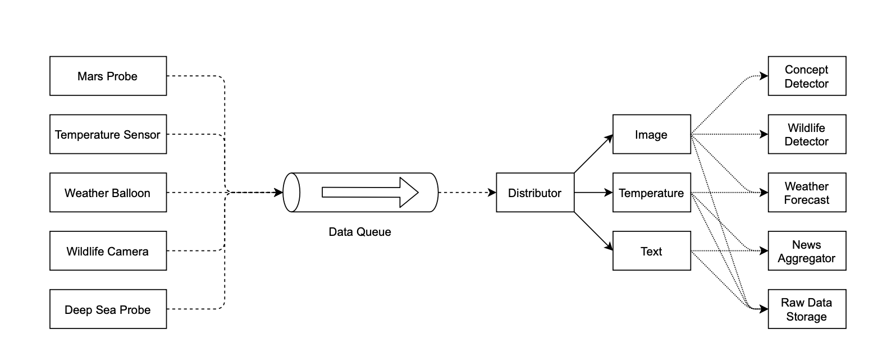

# Message Oriented Middleware

This project aims to gain practical experience with different types of message oriented middleware: 
message queues and publish/subscribe mechanism.

System consists of three parts:
* data probes (producers)
* data distributors (middleware)
* feature processors (consumers)

Data probes communicate with data distributors through message queues, 
and data is distributed to feature processors through a publish-subscribe mechanism.

Once data probe is collected, it enqueues the probe reading into the data queue. 
If a `Distributor` is available, it will retrieve the message containing the probe reading from the data queue 
and distribute it to all related type subscribers through a publish-subscribe mechanism. 
Only if its data was successfully published, does the `Distributor` remove the corresponding message from the data queue (exactly once principle).
Finally, the probe reading is processed by the subscribers to the related type, for example, weather forecasts and news aggregators.